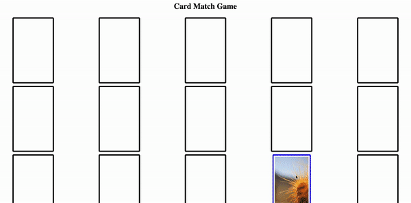
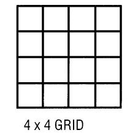

# Matching-game-nextjs
## What does that mean?
### Concentration, also known as Matching Pairs, Match Match, Match Up, Memory, Pelmanism, Shinkei-suijaku, Pexeso or simply Pairs, is a card game in which all of the cards are laid face down on a surface and two cards are flipped face up over each turn. The object of the game is to turn over pairs of matching cards.
## What required : 
- using this api to get images [api](https://picsum.photos/)
- Game should have a win mechanism 
- Game should have a limit turns (saved in redux store)
- Game should have a Play again Feature: 
## example :

## Grid should be 4*4:

## Design Rules
- Be as Creative as you can having a good UI/UX is import 
## Software rules 
### Project structure


- depending on what flow to take
    - Follow the component container pattern, so your two main folders inside the `src` will be the `components` folder that will contain your components and `containers` that will contain container components. *You can read more about container components [here](https://reactpatterns.com/#container-component) or you can ask you team leader about it for more clarity.*

- You can use `postcss` if you are going with another library that uses something like `tailwind`
- Global style variables will be inside a `style` folder inside the `src` inside a `globals.css.` 
- The main folder names inside the `src` should be lower case like `components` and `container or pages` other folders inside them should be TitleCase like `ProgressBar` and files inside these folder will be TitleCase too like `ProgressBar.js.` If you need styles then add them with the same `.js` file name like `ProgressBar.scss`

Your project hierarchy should look something similar to this:

```
.
├── src
	├── Pages
		├── Homepage
			├── ProgressBar.jsx
			├── ProgressBar.scss/css
	├── components
		├── ProgressBar
			├── ProgressBar.jsx
			├── ProgressBar.scss/css
	├── containers
		├── About
				├── ContactForm.jsx
				├── About.js
	├── style
		├── _variables.scss
```

- All dependencies inside the `package.json` should be used in the project.
- It's recommended to use Yarn to install the packages.
- General use images should be inside a folder inside `src` under `images` and try to use `svg` as much as possible. Component specific images should be under their folders.
- You should have prettier extension installed and make sure your code is well formatted before submitting it.
